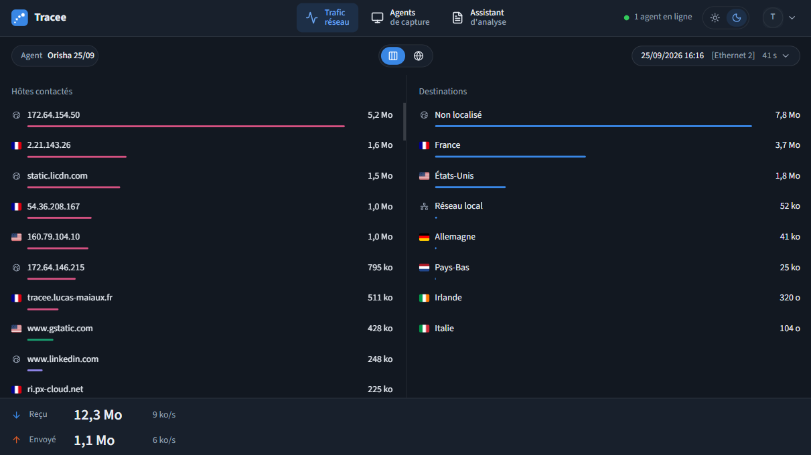
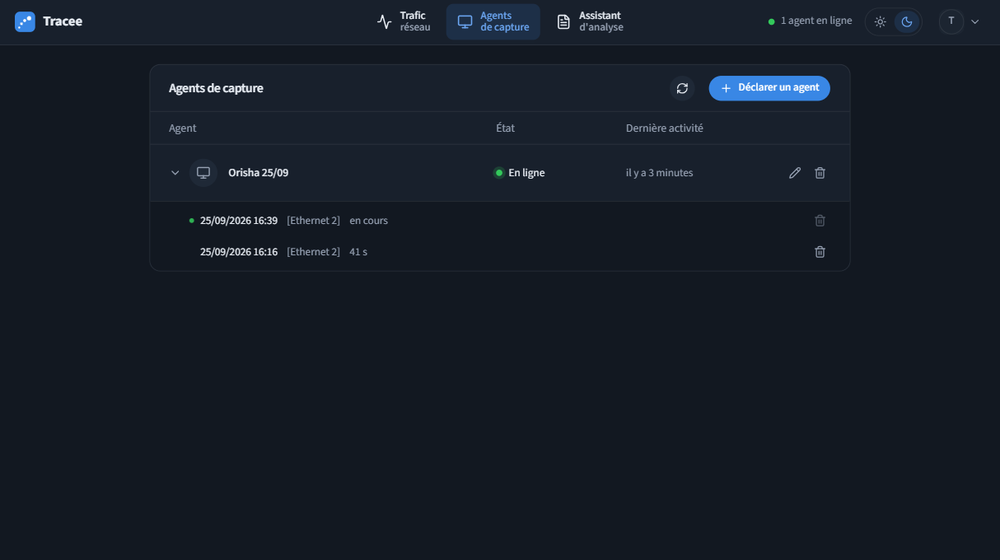
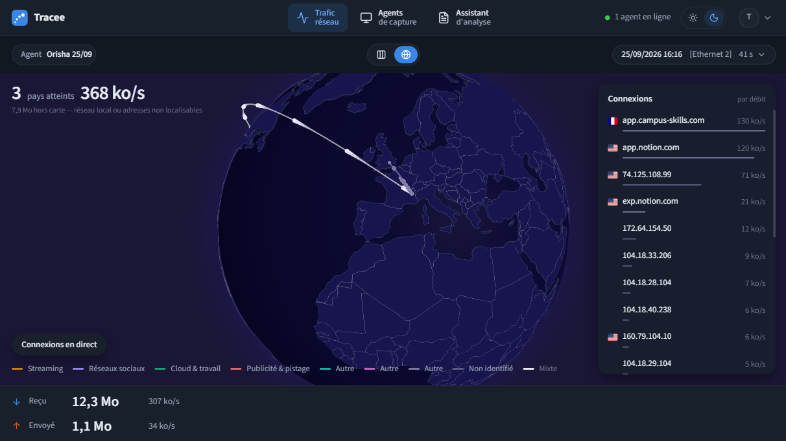
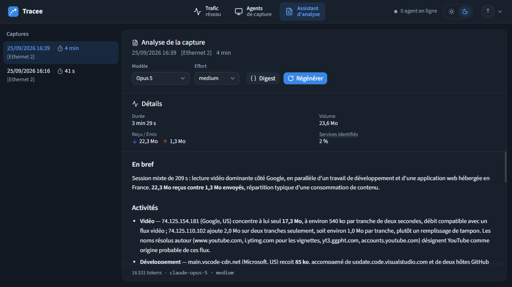

<div align="center">


# Tracee

**Suivez la trace de vos données**

[Télécharger](#téléchargement) · [Démarrage rapide](#démarrage-rapide) · [Le site Tracee](https://tracee.lucas-maiaux.fr)

<a href="https://raw.githubusercontent.com/lucasmaiaux/tracee-agent/main/docs/screens/trafic.png"></a> <a href="https://raw.githubusercontent.com/lucasmaiaux/tracee-agent/main/docs/screens/agents.png"></a>
<a href="https://raw.githubusercontent.com/lucasmaiaux/tracee-agent/main/docs/screens/globe.png"></a> <a href="https://raw.githubusercontent.com/lucasmaiaux/tracee-agent/main/docs/screens/analysis.png"></a>

</div>

## Présentation

Tracee vous montre en direct, sur un globe en 3D, avec quels pays et quels services votre ordinateur échange : Netflix, Google, Discord… Une IA vous explique ensuite ce qu'elle a observé.

Il suffit d'installer l'application Tracee sur votre ordinateur, puis de tout suivre depuis le [site Tracee](https://tracee.lucas-maiaux.fr). Tracee ne lit jamais le contenu de vos échanges : vos messages, vos mots de passe et le contenu des pages que vous consultez restent privés.

## Téléchargement

| Système | Architecture | Fichier |
|---|---|---|
| Windows 10 / 11 | x64 | [tracee-agent-windows-x86_64.exe](https://github.com/lucasmaiaux/tracee-agent/releases/latest/download/tracee-agent-windows-x86_64.exe) |
| Linux | x64 | [tracee-agent-linux-x86_64](https://github.com/lucasmaiaux/tracee-agent/releases/latest/download/tracee-agent-linux-x86_64) |

Ces liens pointent toujours vers la dernière version. Les versions précédentes sont dans les [Releases](https://github.com/lucasmaiaux/tracee-agent/releases).

> [!IMPORTANT]
> Avant le premier lancement, quelques éléments sont à installer selon votre système. Suivez le [démarrage rapide](#démarrage-rapide).

## Démarrage rapide

Commencez par récupérer votre **jeton de connexion** : connectez-vous sur le [site Tracee](https://tracee.lucas-maiaux.fr), ouvrez la page **Agents de capture** et cliquez sur **Déclarer un agent**. Copiez le jeton tout de suite : il n'est affiché qu'une seule fois.

### Windows

**À installer une fois**

- **[Npcap](https://npcap.com/#download)** : le composant qui permet d'observer le trafic de votre ordinateur. C'est le même que celui de Wireshark.

**Lancer Tracee**

1. Téléchargez `tracee-agent-windows-x86_64.exe` et placez-le sur votre Bureau ou dans Téléchargements.
2. Double-cliquez dessus, puis acceptez quand Windows demande l'autorisation.
   Si Windows affiche « Windows a protégé votre ordinateur », cliquez sur **Informations complémentaires**, puis **Exécuter quand même**.
3. Collez votre jeton dans le champ **Token**, choisissez votre connexion (Wi-Fi ou câble) dans **Interface**, puis cliquez sur **Démarrer**.

### Linux

**À installer une fois**

- L'outil `setcap`, souvent déjà présent. Sinon :

```bash
sudo apt install libcap2-bin     # Debian / Ubuntu
sudo dnf install libcap          # Fedora
sudo pacman -S libcap            # Arch
```

**Lancer Tracee**

1. Téléchargez `tracee-agent-linux-x86_64` dans un dossier personnel, puis autorisez-le à observer le trafic. À refaire après chaque nouveau téléchargement :

   ```bash
   chmod +x tracee-agent-linux-x86_64
   sudo setcap cap_net_raw,cap_net_admin+ep tracee-agent-linux-x86_64
   ```

2. Lancez-le :

   ```bash
   ./tracee-agent-linux-x86_64
   ```

3. Collez votre jeton dans le champ **Token**, choisissez votre connexion (Wi-Fi ou câble) dans **Interface**, puis cliquez sur **Démarrer**.

### Et ensuite ?

Votre trafic apparaît sur le globe du [site Tracee](https://tracee.lucas-maiaux.fr). Vos réglages sont mémorisés : la prochaine fois, un clic sur **Démarrer** suffit.

## Auteur

Lucas MAIAUX ([@lucasmaiaux](https://github.com/lucasmaiaux)). Projet réalisé dans le cadre du **Projet Libre 2026**, Campus Numérique in the Alps, formation Développeur Avancé.
